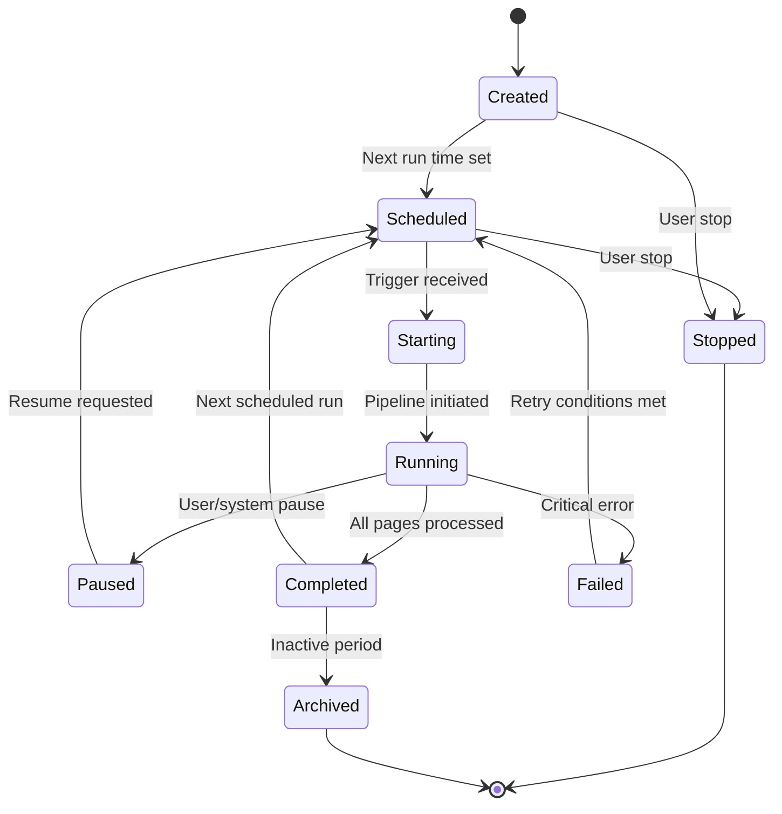
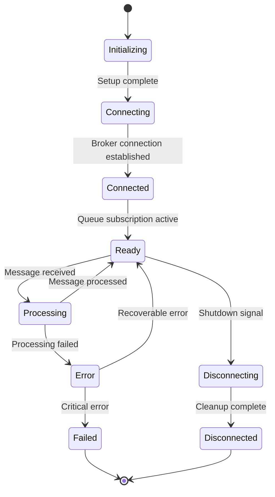
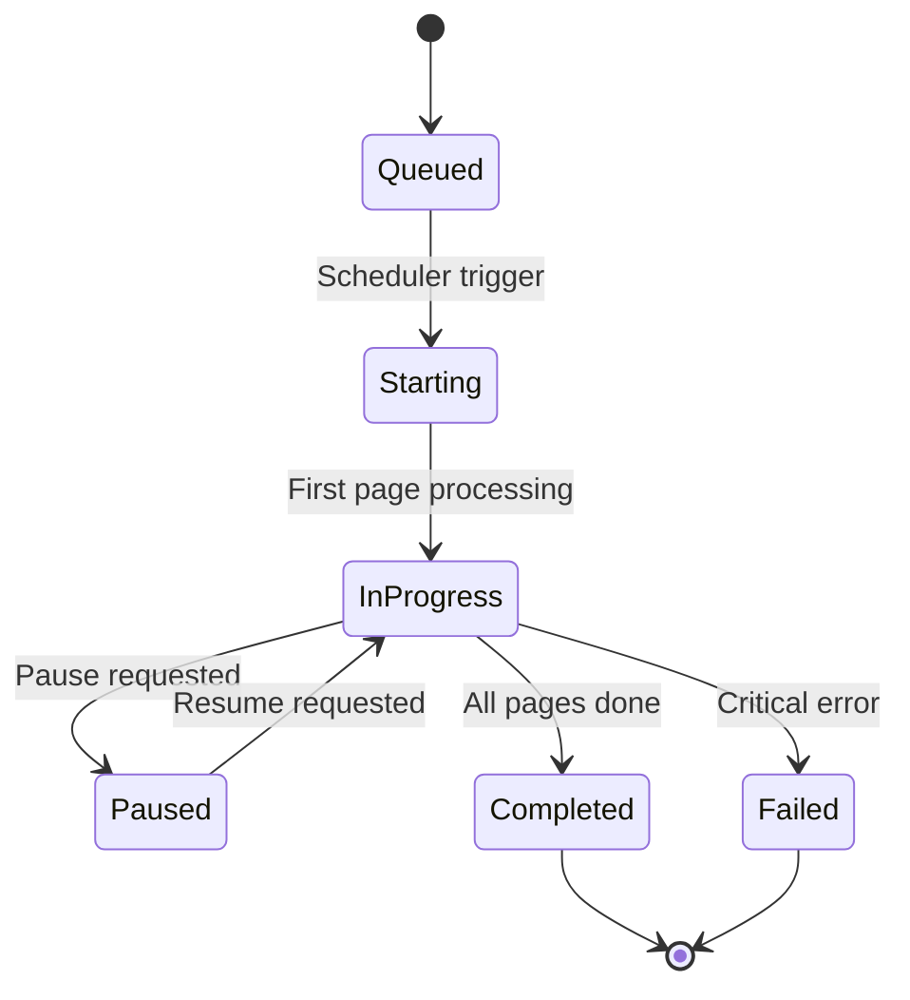
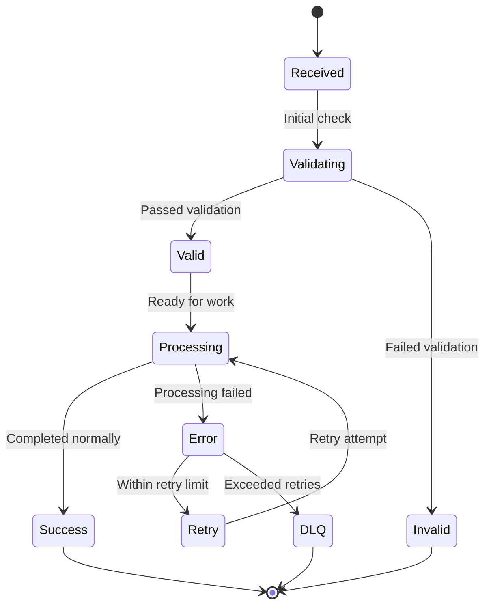

# State Machine

This document describes the finite state machines used throughout Webloom to manage job execution, agent lifecycles, and system operations. State machines ensure predictable behavior, clear transitions, and robust error handling.

## 🎯 Purpose

State machines in Webloom provide:

- Deterministic behavior
- Clear transition rules
- Error recovery paths
- Consistent user experience
- Simplified debugging
- Predictable system responses

## 🏗 Job State Machine

### States



### State Descriptions

#### Created
- Initial state upon job creation
- Configuration stored
- No active processing
- Valid transitions: Scheduled, Stopped

#### Scheduled
- Waiting for execution trigger
- Next run time calculated
- Valid transitions: Starting, Stopped, Failed, Completed, Archived

#### Starting
- Job initiation in progress
- Run record created
- Agent coordination begins
- Valid transitions: Running, Failed

#### Running
- Active pipeline execution
- Pages being processed
- Metrics collected
- Valid transitions: Paused, Completed, Failed

#### Paused
- Temporary suspension
- State preserved
- No new processing
- Valid transitions: Scheduled, Stopped

#### Completed
- Successful execution
- All pages processed
- Metrics finalized
- Valid transitions: Scheduled, Stopped, Archived

#### Failed
- Error occurred
- Details logged
- May retry
- Valid transitions: Scheduled, Stopped

#### Stopped
- Permanent termination
- Cleanup performed
- Resources released
- Valid transitions: None (terminal)

#### Archived
- Long-term storage
- Reduced resources
- Historical reference
- Valid transitions: None (terminal)

## 🤖 Agent State Machine

### States



### State Descriptions

#### Initializing
- Agent startup
- Configuration loading
- Dependency setup
- Valid transitions: Connecting

#### Connecting
- Establishing broker connection
- Authenticating
- Setting up exchanges
- Valid transitions: Connected, Failed

#### Connected
- Connection established
- Preparing subscriptions
- Valid transitions: Ready, Failed

#### Ready
- Awaiting messages
- Heartbeat active
- Valid transitions: Processing, Disconnecting, Failed

#### Processing
- Message handling
- Pipeline execution
- Valid transitions: Ready, Error

#### Error
- Non-critical failure
- Retry logic active
- Valid transitions: Ready, Failed

#### Failed
- Critical failure
- Requires intervention
- Valid transitions: None (terminal)

#### Disconnecting
- Graceful shutdown
- Resource cleanup
- Valid transitions: Disconnected

#### Disconnected
- Agent terminated
- Resources released
- Valid transitions: None (terminal)

## 📊 Run State Machine

### States



### State Descriptions

#### Queued
- Waiting for execution slot
- Scheduler evaluation pending
- Valid transitions: Starting

#### Starting
- Run initialization
- First page dispatched
- Valid transitions: InProgress, Failed

#### InProgress
- Active page processing
- Metrics updating
- Valid transitions: Paused, Completed, Failed

#### Paused
- Temporary suspension
- State preserved
- Valid transitions: InProgress

#### Completed
- Successful completion
- Metrics finalized
- Valid transitions: None (terminal)

#### Failed
- Execution failure
- Error recorded
- Valid transitions: None (terminal)

## 🔄 Message Processing State Machine

### States



### State Descriptions

#### Received
- Message arrived in queue
- Initial receipt acknowledgment
- Valid transitions: Validating

#### Validating
- Input validation
- Security checks
- Format verification
- Valid transitions: Valid, Invalid

#### Valid
- Message passed validation
- Ready for processing
- Valid transitions: Processing

#### Invalid
- Message failed validation
- Logged and discarded
- Valid transitions: None (terminal)

#### Processing
- Active work execution
- Resource utilization
- Valid transitions: Success, Error

#### Success
- Processing completed
- Results published
- Valid transitions: None (terminal)

#### Error
- Processing failure
- Error details captured
- Valid transitions: Retry, DLQ

#### Retry
- Scheduled for retry
- Backoff applied
- Valid transitions: Processing

#### DLQ
- Moved to dead letter queue
- Manual intervention needed
- Valid transitions: None (terminal)

## ⚙️ Transition Guards

### Job Transitions
- Time-based: Scheduled → Starting
- User action: Any state → Stopped
- System limits: Running → Failed
- Resource availability: Scheduled → Starting

### Agent Transitions
- Connection status: Connecting ↔ Connected
- Message flow: Ready ↔ Processing
- Error conditions: Any state → Error/Failed
- Shutdown signal: Ready → Disconnecting

### Run Transitions
- Page completion: InProgress → Completed
- Error threshold: InProgress → Failed
- User request: InProgress ↔ Paused
- Scheduler: Queued → Starting

### Message Transitions
- Validation rules: Received → Valid/Invalid
- Processing outcome: Processing → Success/Error
- Retry policy: Error ↔ Retry
- Retry exhaustion: Error → DLQ

## 🛡 Error Recovery Patterns

### Retry Logic
```
State: Error
If retry_count < max_retries:
    Apply backoff
    Transition: Retry
Else:
    Transition: DLQ
```

### Circuit Breaker
```
If consecutive_errors > threshold:
    Open circuit breaker
    Reject new messages temporarily
    After timeout:
        Half-open state
        Test with probe message
        If success: Close circuit
        If failure: Remain open
```

### Graceful Degradation
```
If non-critical service unavailable:
    Log warning
    Continue with reduced functionality
    Attempt reconnection periodically
```

## 📈 Monitoring

### State Metrics
- Time in each state
- Transition frequency
- Error rates by state
- Recovery success rates

### Alerting Triggers
- Stuck states (no transitions)
- High error rates
- Failed state transitions
- Resource exhaustion

## 🧪 Testing Strategy

### State Coverage
- All states reachable
- All transitions tested
- Error states validated
- Recovery paths verified

### Edge Cases
- Invalid state transitions
- Concurrent state changes
- Resource exhaustion
- Network partitions

### Integration Points
- Database state consistency
- Message queue behavior
- External service failures
- Clock drift scenarios

## 📝 Summary

Webloom's state machines ensure:

- **Predictability**: Clear, documented state transitions
- **Reliability**: Robust error handling and recovery
- **Maintainability**: Simplified debugging and testing
- **Scalability**: Consistent behavior under load
- **Observability**: Comprehensive monitoring capabilities

These finite state machines are fundamental to Webloom's robust, production-ready architecture.

END OF FILE